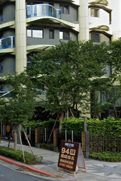
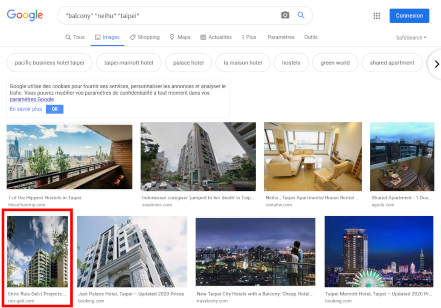
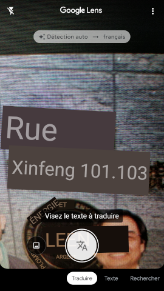

# Bienveillance arboricole I

## Intitulé
Bravo Inspecteur !

L'image accompagnant le tweet supprimé nous apprend qu'un couple d'amis a prêté son appartement au voyageur temporel l'été dernier.

Nous ne savons malheureusement pas où se trouve cet appartement.

*Pouvez-vous retrouver le nom de la rue où se situe cette résidence ?*

## Solution
L'image en question était la suivante :

La recherche d'image inversée ne donnant rien de concret, le cheminement suivant mène à la solution :
1. Trouver à l'aide d'un outil d'OCR (Reconnaissance optique de caractères) que la pancarte est écrite en Chinois
2. Rechercher les indicatifs téléphoniques pour isoler une région (en l'occurence, Taiwan)
3. Isoler deux localités de Taiwan à l'aide de la longueur du numéro de téléphone (8 chiffres) en étudiant le [plan de numérotation](https://en.wikipedia.org/wiki/Telephone_numbers_in_Taiwan)
4. En cherchant dans un moteur de recherche `"2790" + "taipei"`, identifier le quartier de Neihu (Neihu District)
5. Focaliser les recherches d'images sur les éléments architecturaux en plus des informations trouvées précédemment : `"balcony" "neihu" "taipei"`

Ce cheminement nous conduit à trouver l'image suivante dans la recherche d'image Google :

Sur le site de cette architecte, la [photo de la cérémonie d'ouverture](https://www.ruiz-geli.com/img/projects/h108/opening-cerimony/03_h108_project__taipei__ma.jpg) donne l'addresse de cette résidence en usant de l'OCR :

Une vérification rapide dans Google Maps valide la trouvaille : https://goo.gl/maps/AhcvpPrYjiJYJdqQ9

**Les flags : UYBHYS{xinfeng} || UYBHYS{xinfeng street} || UYBHYS{xinfengstreet}**
## Outils
OCR (ex.: Google Lens) / Moteur de recherche (ex.: Google) / Google Maps