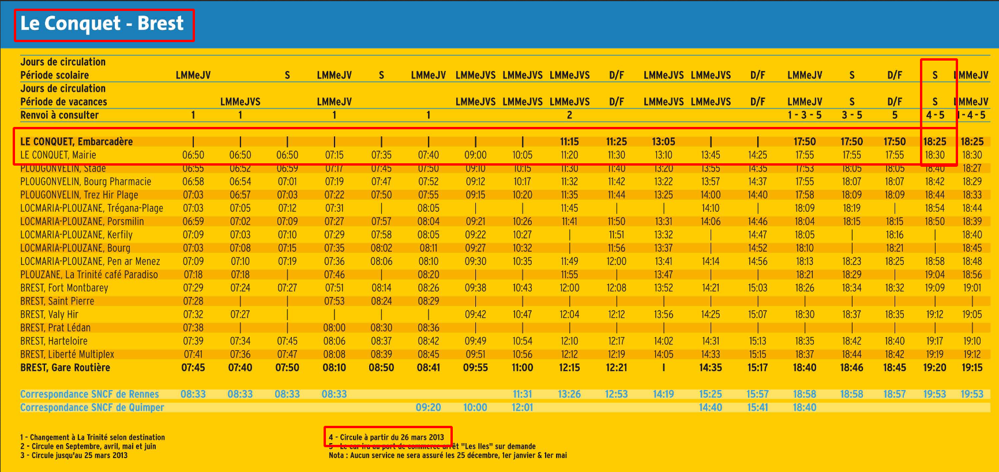

# Bus spotting

## Intitulé

Nous avons reçu d'autres informations sur les lieux qu'a visités le voyageur temporel.

Il a été vu montant dans un car pour Brest après avoir pris cette photo, le 15 juin 2013.

*À quelle heure était ce car pour Brest ?*

Le flag est à donner sous cette forme : **UYBHYS{hhmm}**. Ex.: UYBHYS{1110} pour un horaire à 11h10.

## Solution

Indices :
* un **car** pour Brest
* 15 juin 2013

Sur la photo nous pouvons identifier un bateau le NADIA TONY qui, une fois cherché sur Internet, nous donne son [Port d'attache](http://brbateaux.e-monsite.com/pages/nadia-tony-br853149.html) qui est [Le Conquet](https://www.google.com/maps/@48.3594685,-4.7799322,3a,81.5y,353.62h,85.7t/data=!3m6!1e1!3m4!1sREamlupFCJ5UT6H6GTo5ow!2e0!7i13312!8i6656).

Nous connaissons la date à laquelle a était prise la photo, c'est-à-dire le 15 juin 2013. Nous pouvons alors utiliser les ombres afin de déterminer l'heure à laquelle a été prise la photo :

En utilisant un outil tel que [suncalc.org](https://www.suncalc.org/#/48.3596,-4.7797,19/2013.06.15/16:13/1/1), nous pouvons estimer une heure à l'aide des ombres vu sur la photo qui semble presque parrallèle au quai :

Il ne nous reste plus qu'à trouver les horaires d'un **car** entre **Le Conquet et Brest** en **2013**.

Dans un naviguateur, la requête `le "conquet-brest" car "2013"` nous permettait de trouver un [document](http://www.locmaria-plouzane.fr/IMG/pdf_LeConquet-Brest.pdf), avec les horaires qui nous intéressent :

**Les flags : UYBHYS{1825} || UYBHYS{1830}**

## Outils
SunCalc / Moteur de recherche (ex.: Google)