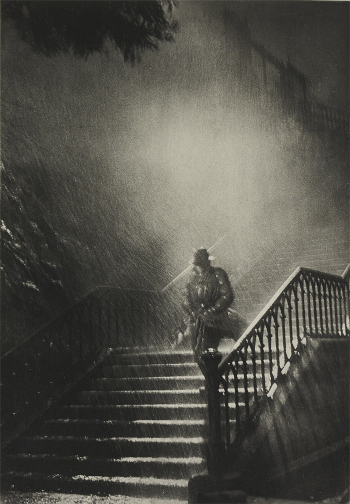

# It's a kind of magic I

## Intitulé
D'après nos informations, le voyageur temporel essaierait d'entrer en contact avec son grand-père, pompier volontaire ayant participé au tournage de ce film :

Le voyageur temporel devrait le retrouver à un de ses spots de surf préférés où se trouve également l'équipe du film.

*Pouvez-vous retrouver le lieu du rendez-vous ?*

## Limitations
Seulement 3 essais disponibles afin de limiter les tentatives de résolutions en "brute-forçant" la réponse avec des listes de spots de surf.

## Solution
Le nom de l'image nous donne déjà un indice sur le lieu où se déroule la scène du film : `cours_dajot.jpg`

Il s'agit donc d'un lieu à Brest, plus particulièrement les escaliers descendant du Cours Dajot et menant au port de commerce : https://fr.wikipedia.org/wiki/Cours_Dajot#Escalier_descendant_%C3%A0_Porstrein

Dans cet article de Wikipédia, nous découvrons le nom d'un film dont la scène finale a été filmée au Cours Dajot, le film Remorques : https://fr.wikipedia.org/wiki/Remorques

C'est ici que la référence à la **plage du Vougot** apparaît et engendra frustration, maux de tête, indignations et autres émotions négatives lors de ce CTF.

La difficulté, et ce qui était attendu, était de recontextualiser et repartir du fait que le voyageur temporel est très attaché à Brest, tout comme son grand-père pompier volontaire selon l'anecdote autour du film :

> La pluie provenait en effet de canons à eau des pompiers et c'est un avion à hélices de l'aéro-club de Guipavas, amputé de ses ailes, qui pallia ce soir-là l'absence de vent.

Le film lui-même est emblématique de Brest : le port, le caractère des personnages, etc. La Cinémathèque de Bretagne possède donc une fiche propre à ce film : http://www.cinematheque-bretagne.bzh/dossiers/Bretagne_et_Cinema/fiches/fiche_4_1_2_1.html

En lisant cette fiche, nous pouvons découvrir un des spots de surf les plus mythiques de la région brestoise, le spot de la Pointe du Petit-Minou :

**Les flags : UYBHYS{Pointe du Petit Minou} || UYBHYS{Le Minou} || UYBHYS{LeMinou} || UYBHYS{PointeduPetitMinou} || UYBHYS{LePetitMinou} || UYBHYS{Le Petit Minou} || UYBHYS{Petit-Minou} || UYBHYS{Le Petit-Minou} || UYBHYS{LePetit-Minou} || UYBHYS{PetitMinou} || UYBHYS{Petit Minou} || UYBHYS{La Pointe du Minou} || UYBHYS{La Pointe du Minou}**
## Outils
Moteur de recherche (ex.: Google)
