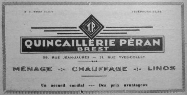

# It's a kind of magic III

## Intitulé
Bien joué Inspecteur ! Vous faites un travail remarquable sur cette enquête.

Nous recherchons cet autre commerce, installé à la même adresse dans les années 30-40, qui aurait fourni le voyageur temporel en pièces détachées.

*De quel commerce s'agit-il ?*

## Solution
Ici, nous cherchons un commerce à la même addresse que Magic Surf, le 31 rue Yves Collet, mais dans les années 1930 et 1940.

Une recherche avec la requête `"1930" "31 rue Yves Collet"` dans un moteur de recherche donne en troisième position [ce lien](http://bibliotheque.idbe-bzh.org/data/cle_32/Adsao_FAvrier_1934_.pdf) :

En page 6 de ce pdf, nous pouvons y découvrir une vieille publicité d'une quincaillerie brestoise établie au 31 rue Yves Collet :

**Les flags : UYBHYS{quincaillerie péran} || UYBHYS{quincailleriepéran} || UYBHYS{quincaillerie peran} || UYBHYS{quincaillerieperan}**

## Outils
Moteur de recherche (ex.: Google)
