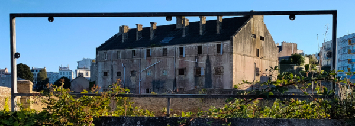

# La bonne porte

## Intitulé
En revenant sur un lieu qui lui était cher, notre voyageur temporel a pris une photo souvenir :

*Quel est le nom de famille de la dernière personne à avoir géré ce commerce ?*

## Indice
Le bâtiment à l'arrière-plan de la photo n'est pas le commerce en question.

## Solution
La première étape est de trouver quel est ce bâtiment. Une recherche d'images avec comme requête `vieux bâtiment brest` nous fait découvrir [un autre angle de ce bâtiment](https://mvistatic.com/photosmvi/2019/04/25/P19864516D3680412G.jpg) et aussi son nom : **Prison de Pontaniou**.

Téléverser l'image dans Yandex permettait aussi de mener au nom du bâtiment ici : https://commons.wikimedia.org/wiki/File:043_La_prison_de_Pontaniou.jpg

L'étape suivante serait alors de retrouver l'endroit d'où a été pris la photo. À l'aide de Google Maps et après un peu de promenade, nous découvrons l'endroit : https://goo.gl/maps/ChSydLwHRoLW9RiA7

Remarquons néanmoins que Yandex est plus utile que Google Maps concernant une recherche avec vue satellite. Bien que les images datent de 2012, celles-ci ne sont pas floutées au contraite de Google Maps : https://yandex.com/maps/-/CCUANGVAsD

Nous découvrons alors le même support en métal que dans l'image du challenge. Avec l'historique de Street View, nous pouvons voir l'affiche que contenait cette structure en 2010 :

Pour l'histoire, la *Grappe Fleurie* était le vin phare des [frères Guével](https://www.ouest-france.fr/bretagne/morlaix-29600/le-bistrot-de-lhistoire-revient-sur-les-vins-guevel-3796924) :

> Le vin proposé chez Guével est du vin d'Algérie coupé avec du rosé d'Oran, qui correspond assez bien au goût des Bretons : un vin facile à avaler mais assez fort en alcool.

La dernière étape est de rechercher dans [le Registre du Commerce et des Sociétés](https://infogreffe.fr) des informations sur "Le Trou" à Brest pour trouver [cette fiche](https://www.infogreffe.fr/entreprise-societe/342287646-rampinelli-marie-claire-290187A004470000.html?typeProduitOnglet=EXTRAIT&afficherretour=true&tab=entrep) sur Infogreffe.fr.

**Le flag : UYBHYS{RAMPINELLI}**

## Outils
Moteur de recherche (ex.: Google) / Recherche d'image inversée / Google Street View / Infogreffe
