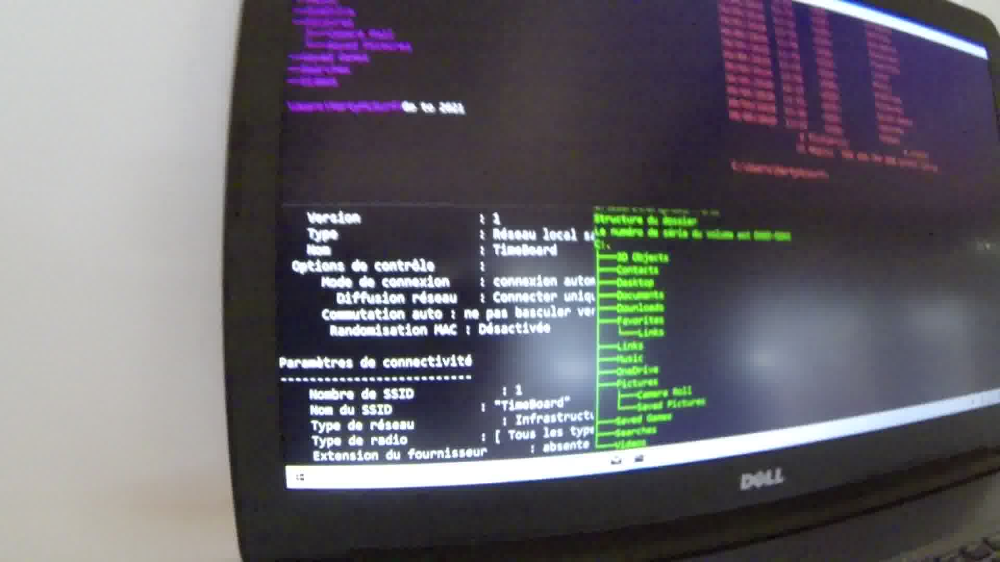
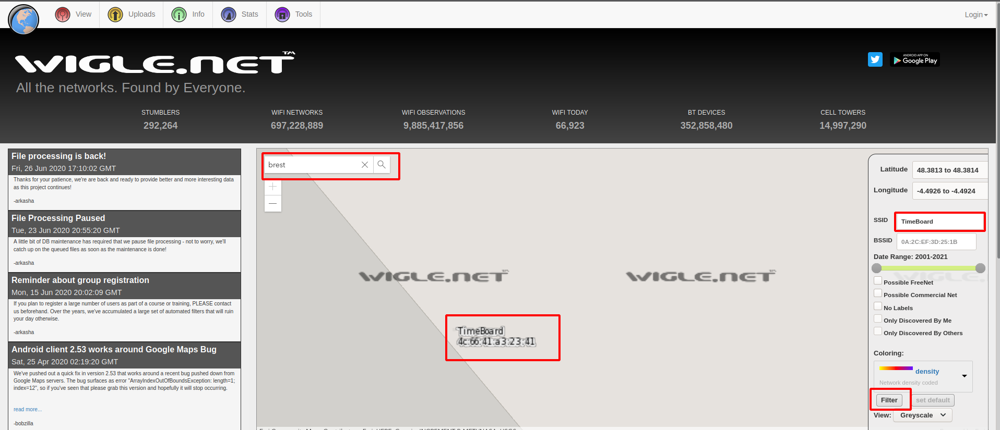

# Old School II

## Intitulé

Merci Inspecteur !

Nous commençons à mieux cartographier la présence en ligne du voyageur temporel grâce à votre travail.

Nos capteurs ouverts nous ont signalés qu'une vidéo présente sur sa chaîne nous permettrait d'identifier la machine temporelle qu'il utilise pour voyager.

*Sauriez-vous retrouver son adresse MAC ?*

P.S.: nos archivistes de 2600 ont réussi à repixeliser la vidéo avec VideoProEnhancerUltimateEdition 12.3. Nous vous fournissons une copie de cette vidéo ci-dessous.

## Solution

Il est possible d'extraire chaque frame de cette vidéo afin d'en trouver une "lisible" à l'aide de **ffmpeg** et la commande suivante :

`ffmpeg -i 12-12-12.MP4 thumb%04d.jpg`

Sur cette image, nous pouvons apercevoir la mention d'un SSID nommé **TimeBoard** :

Il existe des bases de données où les utilisateurs y rentrent notament les informations des points d'accès wifi qu'ils ont croisés. [Wigle](https://wigle.net/) est l'une d'entre elles. Avec les informations que nous avons :
* Nous cherchons une adresse MAC
* sur Brest (étant donné le contexte)
* SSID == TimeBoard

**Le flag : UYBHYS{4C:66:41:a3:23:41}**

## Outils
Bases de données communautaire de point d'accès WiFi
