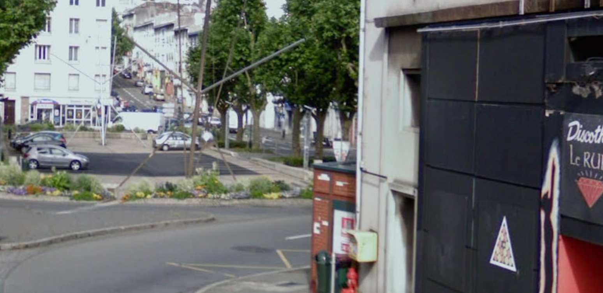
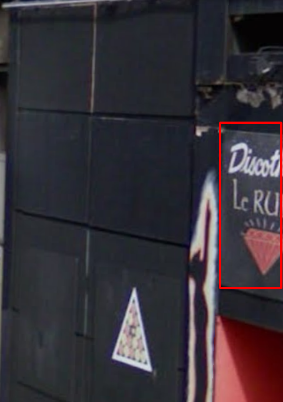

# Perds pas la boule I

## Intitulé

Même le voyageur temporel a besoin de se détendre !

Entre chaque saut temporel, il aime se divertir dans ce lieu public :

Nous aimerions interroger des personnes qui auraient pu le croiser lors de ses instants de détente où il se confie aisément.

*Quelle est le nom de cette rue ?*

## Solution

Sur la photo nous pouvons identifier une discothèque nommée (Le RU**) avec l'image d'un rubis.

En recherchant dans un naviguateur `discothèque le rubis brest`, nous trouvons une discothèque sur Brest situé "rue de la porte" à Recouvrance. 

**Les flags : UYBHYS{ruedelaporte} || UYBHYS{rue de la porte}**

## Outils
Moteur de recherche (ex.: Google)
