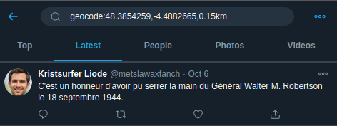
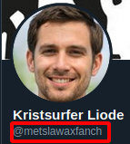

# We will soon... II

## Intitulé

Merci pour votre aide, Inspecteur !

Nous avons confirmation d'un de nos indics que le voyageur temporel a été aperçu à une centaine de mètres de l'endroit que vous avez découvert, plongé dans son smartphone.

Nous voudrions en savoir plus sur ses activités en ligne : *pouvez-vous retrouver son nom d'utilisateur (handle) Twitter ?*

## Solution

L'épreuve précédente nous permet d'identifier [Le Comoedia Espace d'art](https://www.google.com/maps/place/Le+Comoedia+Espace+d'art/@48.3854259,-4.4882665,3a,75y,189.37h,111.53t,2.02r/data=!3m6!1e1!3m4!1s92s8YwYjESGQLwf-GJ7qXg!2e0!7i13312!8i6656!4m12!1m6!3m5!1s0x0:0xcf4955631796ba9c!2sLe+Comoedia!8m2!3d48.3853054!4d-4.4878593!3m4!1s0x4816b98ea626e371:0xa46110e834c4054!8m2!3d48.3852277!4d-4.4885241) à Brest et non pas le [restaurant](https://www.google.com/maps/@48.3852693,-4.487943,3a,75y,44.17h,75.73t/data=!3m6!1e1!3m4!1s5kU_b6KBkzjTUbNoinqOUQ!2e0!7i13312!8i6656) du même nom.

Ainsi, en utilisant [les opérateurs de localisation de Twitter](https://thoughtfaucet.com/search-twitter-by-location/examples/), il est possible de filtrer notre recherche. Il nous faut le geocode, que nous pouvons prendre dans l'url de street view ainsi qu'un périmètre (une centaine de mètres) :

`geocode:48.3854259,-4.4882665,0.15km`

Puis une fois notre voyageur identifié, il nous faut récupérer son nom d'utilisateur Twitter :

`https://twitter.com/metslawaxfanch` -> `metslawaxfanch`

**Le flag : UYBHYS{metslawaxfanch}**

## Outils
Opérateurs de localisation de Twitter
